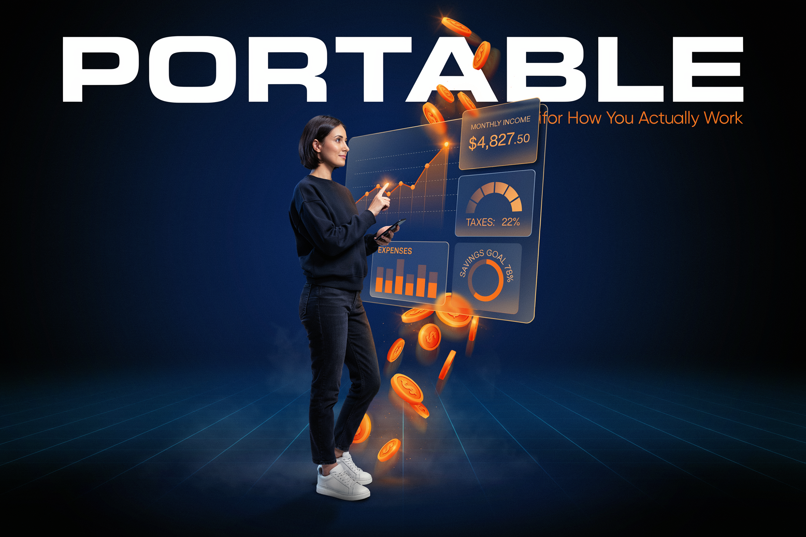

<div align="center">



# 🎒 Portable

**Benefits that move with you — portable health, retirement, and insurance for gig workers**


*HackNomics 2025*

</div>

<br/>

Portable is a financial platform built from the ground up for the 70 million Americans working in the gig economy. Upload a bank statement once and Portable automatically detects income from 50+ platforms, categorizes deductible expenses, and calculates your real-time quarterly tax liability — turning financial chaos into clarity. Where traditional finance tools treat gig work as a side hustle, Portable treats it as the full-time career it is.

## ✨ Features

- **Automatic Income Tracking** — Recognizes income from 50+ platforms including Uber, Lyft, DoorDash, Instacart, Upwork, Fiverr, YouTube, and Patreon; broken down by platform, week, and month
- **Smart Expense Categorization** — Applies IRS-approved deduction rates to every transaction automatically — gas, phone bills, subscriptions, and more — so you stop leaving $3,000–$5,000 on the table each year
- **Real-Time Tax Calculator** — Computes self-employment tax (15.3%), federal income tax, and state estimates with quarterly deadlines and a full-year projection based on current earnings
- **Income Stability Score** — Proprietary algorithm that translates variable gig income into a consistency score that landlords and lenders actually understand
- **Benefits & Services Hub** — Connects gig workers with health insurance, retirement accounts, and financial products designed for self-employed income
- **Hyper-Personalized Guidance** — Platform- and city-specific advice on maximizing earnings, surge opportunities, and tax strategies tailored to your income mix

## 🎥 Demo

[](https://www.youtube.com/watch?v=9AjgeyStgtI)

**Live App**: [portable-buwubjqtb-kyisaiah47s-projects.vercel.app](https://portable-buwubjqtb-kyisaiah47s-projects.vercel.app)

Demo credentials: `sarah.driver@email.com` / `demo123` — or upload `public/sample-bank-statement.csv` to try it with sample data.

## 🛠️ Tech Stack

| Layer | Technology |
|---|---|
| Framework | Next.js 15 (App Router) |
| Language | TypeScript |
| Styling | Tailwind CSS v4 |
| Database / Auth | Supabase (PostgreSQL + Realtime) |
| UI Components | Shadcn UI + Radix |
| Charts | Recharts |
| Icons | Lucide React + React Icons |
| Notifications | Sonner |
| Fonts | Space Grotesk, Inter, Outfit, Sora |

## 🚀 Getting Started

**Prerequisites**: Node.js 18+, Supabase account (free tier)

```bash
git clone https://github.com/kyisaiah47/portable.git
cd portable
npm install
cp .env.example .env.local   # add your Supabase URL and anon key
# run database/supabase-migration-portable.sql in your Supabase SQL editor
npm run dev
# visit http://localhost:3000
```

## 📄 License

MIT
